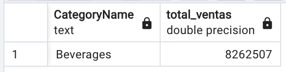
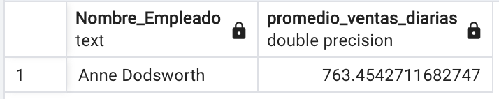

<div align="center">
  <h1>ETL Northwind - Prueba Técnica</h1>
</div>
Este repositorio contiene la solución de la prueba técnica para la implementación de un proceso ETL utilizando **Python, Polars y PostgreSQL**.

## Requisitos

Antes de ejecutar el proyecto, asegúrate de tener instalados los siguientes requisitos:

### Tecnologías utilizadas
```
- Docker        # Server (contenedor).
- Python 3.8+   # Lenguaje de programacion.
- PostgreSQL    # Base de datos.
- SQLAlchemy    # Manipulacion de estructuras de datos.
- Polars        # Manipulacion de datos.
- Psycopg2      # Para manejo de postgreSQL.
```
### Instalación de dependencias
Ejecuta el siguiente comando para instalar todas las dependencias:

```bash
pip install -r requirements.txt
```
## SOLUCIONES:

## 1. Modelado de Data Warehouse

El modelo de datos utilizado en esta prueba técnica sigue un esquema en estrella. Este diseño es ampliamente utilizado en Data Warehouses debido a su eficiencia en consultas analíticas y de agregación.

### Tablas del modelo

Tabla de Hechos:
- **VENTAS (Ventas registradas con métricas de cantidad y precio total).**

Tablas de Dimensiones:
- **D_TIEMPO (Dimensión de tiempo con granularidad de fecha, mes y año).**
- **D_CLIENTES (Información de clientes).**
- **D_PRODUCTOS (Información de productos y sus categorías).**
- **D_CATEGORIAS (Categorías de productos).**
- **D_EMPLEADOS (Vendedores y empleados involucrados en ventas).**
- **D_REGIONES (Regiones donde ocurren las ventas).**

Ahora bien la justificacion por el cual se utilizo este tipo de esquema de estrella es el siguiente:
- Tiene un mejor rendimiento en consultas.
- Permite una rápida agregación y análisis de datos en herramientas de BI.
- El que este desnormalizada evita cruces costosos en memoria.

<div align="center">
  <h1>MODELO ESTRELLA DWH</h1>
</div>

<div align="center"> 
  
</div>

## 2. Desarrollo de ETL 

Se monto un contenedor con postgreSQL utilizando Docker-compose para poder tener la permanencia de los datos en el servidor, el YAML contine las configuraciones necesarias para poder crear un contenedor con postgreSQL.

<div align="center"> 
  
</div>

 
```
version: '3.8'

services:
  postgres:
    image: postgres:latest
    container_name: postgres_silvio
    restart: always
    environment:
      POSTGRES_USER: silvioMiranda
      POSTGRES_PASSWORD: Smirlop
      POSTGRES_DB: mydatabase
    ports:
      - "5432:5432"
    volumes:
      - postgres_data:/var/lib/postgresql/data
      - ./init.sql:/docker-entrypoint-initdb.d/init.sql

volumes:
  postgres_data:
```

Con pgAdmin visualizamos las estructuras de datos que se crearon a partir del Modelo **Northwind_DWH**

<div align="center"> 
  
</div>


## 3. Business Intelligence

Las siguientes consultas resuelven toda la seccion 3.

```sql
-- ¿Qué categoría presentó las mejores ventas durante el año 2016?
SELECT c."CategoryName", SUM(v."Total_Venta") AS total_ventas
FROM public."VENTAS" v
JOIN public."D_PRODUCTOS" p ON v."ProductID" = p."ProductID"
JOIN public."D_CATEGORIAS" c ON p."CategoryID" = c."CategoryID"
JOIN public."D_TIEMPO" t ON v."OrderDate" = t."Fecha"
WHERE t."Año" = 2016
GROUP BY c."CategoryName"
ORDER BY total_ventas DESC
LIMIT 1;
```
<div align="center"> 
  
</div>

```sql
-- ¿Cuál fue el empleado con mejor promedio de ventas diarias (en dinero) en el año 2020?
SELECT e."Nombre_Empleado", AVG(v."Total_Venta") AS promedio_ventas_diarias
FROM public."VENTAS" v
JOIN public."D_EMPLEADOS" e ON v."EmployeeID" = e."EmployeeID"
JOIN public."D_TIEMPO" t ON v."OrderDate" = t."Fecha"
WHERE t."Año" = 2020
GROUP BY e."Nombre_Empleado"
ORDER BY promedio_ventas_diarias DESC
LIMIT 1;
```
<div align="center"> 
  
</div>

```sql
-- ¿Cuál fue el día con mayor cantidad de ventas (en cantidad de operaciones) durante el primer semestre de 2015?
SELECT t."Fecha", COUNT(v."OrderID") AS cantidad_ventas
FROM public."VENTAS" v
JOIN public."D_TIEMPO" t ON v."OrderDate" = t."Fecha"
WHERE t."Año" = 2015 AND t."Mes" BETWEEN 1 AND 6
GROUP BY t."Fecha"
ORDER BY cantidad_ventas DESC
LIMIT 1;
```
<div align="center"> 
  
</div>


```sql
-- Históricamente, ¿cuál es el mejor cliente que ha tenido la empresa?
SELECT c."Nombre_Cliente", SUM(v."Total_Venta") AS total_gastado
FROM public."VENTAS" v
JOIN public."D_CLIENTES" c ON v."CustomerID" = c."CustomerID"
GROUP BY c."Nombre_Cliente"
ORDER BY total_gastado DESC
LIMIT 1;
```
<div align="center"> 
  
</div>


## Configuración

1. **Configurar las credenciales de la base de datos**
   
   Modifica el archivo `etl_northwind/config.py` con las credenciales correctas:
   ```python
   DATABASE_CONFIG = {
       'dbname': 'northwind',
       'user': 'tu_usuario',
       'password': 'tu_contraseña',
       'host': 'localhost',
       'port': '5432'
   }
   ```

2. **Verificar la existencia del script SQL**
   
   Asegúrate de que el archivo `Northwind.sql` se encuentra en:
   ```
   postgres-docker/scripts/Northwind.sql
   ```

   Este archivo contiene la estructura de las tablas y se ejecutará automáticamente al iniciar el ETL.

## Estructura del Proyecto

```
etl_northwind
 ├── config.py             # Configuración de la base de datos
 ├── execute_sql.py        # Creación de tablas en PostgreSQL
 ├── extract.py            # Extracción de datos desde SQLite
 ├── transform.py          # Transformación de datos usando Polars
 ├── load_data.py          # Carga de datos en PostgreSQL
 ├── main.py               # Ejecución del proceso ETL
 ├── requirements.txt      # Dependencias del proyecto
```

<div align="center">
  <h2>Ejecución del ETL</h2>
</div>

Para ejecutar el proceso ETL, usa el siguiente comando:

```bash
python -m etl_northwind.main
```

El proceso se ejecutará en los siguientes pasos:

1 **[Paso 1]** Creación de tablas**: Se verifican y crean las tablas si no existen.

2 **[Paso 2]** Extracción de datos**: Se extraen datos desde la base de datos.

3 **[Paso 3]** Transformación de datos**: Se transforman los datos evitando duplicados.

4 **[Paso 4]** Carga de datos**: Se insertan solo los datos nuevos en PostgreSQL.
